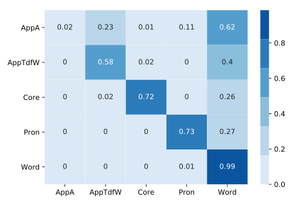

# Figurenerkennung for German literary texts

[](https://travis-ci.com/severinsimmler/figur)
[](https://doi.org/10.5281/zenodo.2592472)


An important step in the quantitative analysis of narrative texts is the automatic recognition of references to figures, a special case of the generic NLP problem of Named Entity Recognition (NER).

Usually NER models are not designed for literary texts resulting in poor recall. This easy-to-use package is the continuation of the work of [Jannidis et al.](https://opus.bibliothek.uni-wuerzburg.de/opus4-wuerzburg/frontdoor/deliver/index/docId/14333/file/Jannidis_Figurenerkennung_Roman.pdf) using techniques from the field of Deep Learning.


## Installation

```
$ pip install figur
```


## Example

```python
>>> import figur
>>> text = "Der Gärtner entfernte sich eilig, und Eduard folgte bald."
>>> figur.tag(text)
   SentenceId      Token      Tag
0           0        Der        _
1           0    Gärtner  AppTdfW
2           0  entfernte        _
3           0       sich     Pron
4           0     eilig,        _
5           0        und        _
6           0     Eduard     Core
7           0     folgte        _
8           0      bald.        _
```


## Figurenerkennung statistics

